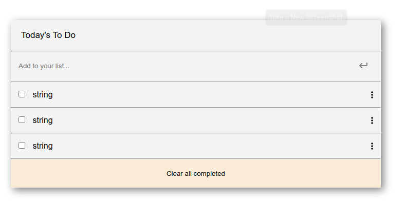

# ToDo list with Webpack

> In this project, I build a basic website that allows users to add/remove taskes from a list, using JavaScript objects and arrays. and dynamically modify the DOM and add basic events.

## Built With

- HTML/CSS, Javascript
- Git/Github, CLI

## Live Demo

[Live Demo Link](https://ismailco.github.io/Todo-list-with-webpack/dist/)

## Getting Started

To get a local copy up and running follow these simple example steps.

### Prerequisites

### Setup

To get the project up and running you need a browser.
[The project live link](Live-Demo-Link)

### Install

To get the project locally, run `git clone git@github.com:Ismailco/Todo-list-with-webpack.git`

### Usage

This project is a To-Do app that let you stor your todo taskes in an object.

### Run tests

For:

- Eslint: run `npx eslint .`
- Eslint: run `npx hint .`
- Stylelint: run `npx stylelint "**/*.{css.scss}"`

## Authors

👤 **Ismail Courr**

- GitHub: [@ismailco](https://github.com/ismailco)
- Twitter: [@ismailcourr](https://twitter.com/ismailcourr)
- LinkedIn: [Ismail Courr](https://linkedin.com/in/ismailcourr)

## 🤝 Contributing

Contributions, issues, and feature requests are welcome!

Feel free to check the [issues page](../../issues/).

## Show your support

Give a ⭐️ if you like this project!

## 📝 License

This project is [MIT](./MIT.md) licensed.
